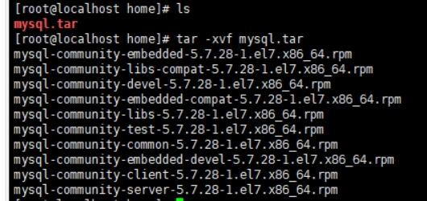

#### 一、环境软件版本

​	CentOS 7

​	Mysql 5.7.28

​	MHA 

#### 二、架构

​	MySQL高可用架构集群环境（4台主机，1主、2从、1 MHA）

#### 三、环境安装过程

​	1、安装mysql数据库

​		上传并解压mysql安装包

​		tar -xvf mysql.tar

 

​		检查CentOs中是否有mariadb，检查并且移除该包

​		rpm -qa|grep mariadb

​		rpm -e mariadb-libs-5.5.64-1.el7.x86_64 --nodeps

 

​		安装mysql的相关依赖，需要以下安装包：

​			mysql-community-common-5.7.28-1.el7.x86_64.rpm 

​			mysql-community-libs-5.7.28-1.el7.x86_64.rpm

​			mysql-community-libs-compat-5.7.28-1.el7.x86_64.rpm

​			mysql-community-client-5.7.28-1.el7.x86_64.rpm

​			mysql-community-server-5.7.28-1.el7.x86_64.rpm

​			mysql-community-devel-5.7.28-1.el7.x86_64.rpm

​		安装命令：rpm –ivh 文件名.rpm

 

 

​		初始化mysql数据库

​			mysqld --initialize --user=mysql

​		查看用户密码

​			cat /var/log/mysqld.log

 

​		设置mysql服务自启动

​			systemctl start mysqld.service

​		查看mysql服务状态

​			systemctl status mysqld.service

 

​		连接mysql，修改用户的随机密码

​			mysql -uroot –p

​			set password=password('密码');

 

 

2、关闭服务器的防火墙

​	检查防火墙状态：

​		systemctl status firewalld

​	关闭防火墙：

​		systemctl stop firewalld

 

​	3、一主两从的同步复制功能（采用半同步复制机制）

​		主库（master）配置：

​			开启主库的binlog日志，修改my.cnf文件

​				cd /etc/my.cnf

​			在my.cnf文件中添加如下内容：

​				log_bin=mysql-bin

​				server-id=1

​				sync-binlog=1

 

​	重启mysql数据库

​		systemctl restart mysqld

 

主库给从库授权

​	连接mysql数据库

​	mysql -uroot -p

​	授权

​	grant replication slave on *.* to 'root'@'%' identified by 'root';

​	grant all privileges on *.* to 'root'@'%' identified by 'root';

​	刷新权限

flush privileges;

查看主库状态

mysql-bin.000001 |   1301

 

​		select @@have_dynamic_loading;

​		查看主库中是否有semi插件

​		show plugins;

 

​		安装semi插件

​		install plugin rpl_semi_sync_master soname 'semisync_master.so';

​		查看semi相关参数

​		show variables like '%semi%';

 

​		设置semi的全局参数

​			set  global rpl_semi_sync_master_enabled=1;

​			set  global rpl_semi_sync_master_timeout=1000;

 

​	从库配置：

​		修改从库的my.cnf文件

​		cd /etc/my.cnf

​		在my.cnf文件中添加如下内容：

​			server-id=2

​			relay_log=mysql-relay-bin

​			read_only=1

 

​		重启数据库

​		systemctl restart mysqld

​		同步初始化

​		change master to 				master_host='192.168.50.20',master_port=3306,master_user='root',master_password='root',master_log_file='mysql-bin.000001',master_log_pos=1301;

 

​	安装semi插件

​		install plugin rpl_semi_sync_slave soname 'semisync_slave.so';

​		查看semi相关参数

​		show variables like '%semi%';

 

​		修改semi参数，启用rpl_semi_sync_slave_enabled

​		set global rpl_semi_sync_slave_enabled=1;	

​	

4、MHA架构搭建

（1）所有的服务器都安装mha4mysql-node

　　mha4mysql-node是所有服务器都需要安装的，首先安装该软件需要的依赖包

yum -y install perl-DBD-MySQL perl-Config-Tiny perl-Log-Dispatch perl-Parallel-ForkManager

（2）上传事先下载好的mha4mysql-node的rpm包，使用rpm安装

​	rpm -ivh mha4mysql-node-0.57-0.el7.noarch.rpm

 

（3）在管理节点manager上安装mha4mysql-manager

　　因为依赖包在安装mha4mysql-node时已经安装了，所以可以直接安装manager。

　　上传事先下载好的mha4mysql-manager的rpm包，使用rpm安装。

​	rpm -ivh mha4mysql-manager-0.57-0.el7.noarch.rpm

 

（4）ssh互信

　　管理节点manager要能免密登录主从复制的所有服务器，而不需要反向免密登录。主从复制的所有服务器之间要能免密登录。

　　所有节点生成密钥

​			ssh-keygen

​		接着互相发送密钥

​			ssh-copy-id 192.168.1.7

​	

​	检查MHA Manger到所有MHA Node的SSH连接状态

​			masterha_check_ssh --conf=/etc/masterha/app1.cnf

 

（5）设置备用master

​		修改其中一台slave的my.cnf配置文件，重启mysqld

​		vim /etc/my.cnf

​		log-bin=mysql-bin-slave1　　//一定要存在二进制日志，因为随时有可能升为master

​		log-slave-updates=1　　//一定要同步到二进制日志文件

​		设置为只读，并关闭中转日志自动清理

 

​		set global read_only=1;　　

​		//从表设置为只读，备用master的只读不能写入配置文件，因为有可能会升为master

（6）配置MHA

创建MHA的工作目录，并且创建相关配置文件    

touch /etc/masterha/app1.cnf

修改配置文件：

​			[server default]

manager_workdir=/etc/masterha/app1.log     

manager_log=/var/log/masterha.log     

master_binlog_dir=/etc/masterha             

\#master_ip_failover_script= /usr/local/bin/master_ip_failover  

\#master_ip_online_change_script= /usr/local/bin/master_ip_online_change  

 

password=root

user=root

ping_interval=1

remote_workdir=/tmp

repl_password=root

repl_user=root

\#report_script=/usr/local/send_report

\#secondary_check_script= /usr/local/bin/masterha_secondary_check -s server03 -s server02       

\#shutdown_script=""  

ssh_user=root

 

[server1]

hostname=192.168.50.20

port=3306

 

[server2]

hostname=192.168.50.120

port=3306

candidate_master=1

check_repl_delay=0

 

[server3]

hostname=192.168.50.252

port=3306

no_master=1

 

​		检查复制环境

​			masterha_check_repl --conf=/etc/masterha/app1.cnf

 

 

#### 四、操作的问题

​	1、虚拟机创建后，无法连接网络

​	https://blog.csdn.net/zs345048102/article/details/79506879

​	2、搭建MHA架构的时候，rpm包依赖问题

​	依赖安装的时候，会因为缺少其他依赖而安装失败，依次下载需要的依赖包进行安装

 

 

#### 五、注意事项

​	1、安装mysql的各安装包需要perl依赖和net-tools依赖

​		yum install -y perl-Module-Install.noarch

​		yum install net-tools

 

 

​	2、安装semi插件时，注意master数据库安装rpl_semi_sync_master，slave数据库安装rpl_semi_sync_slave，不要安装错误。

 