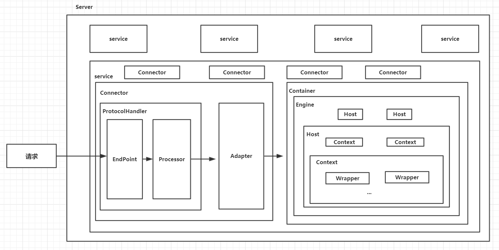
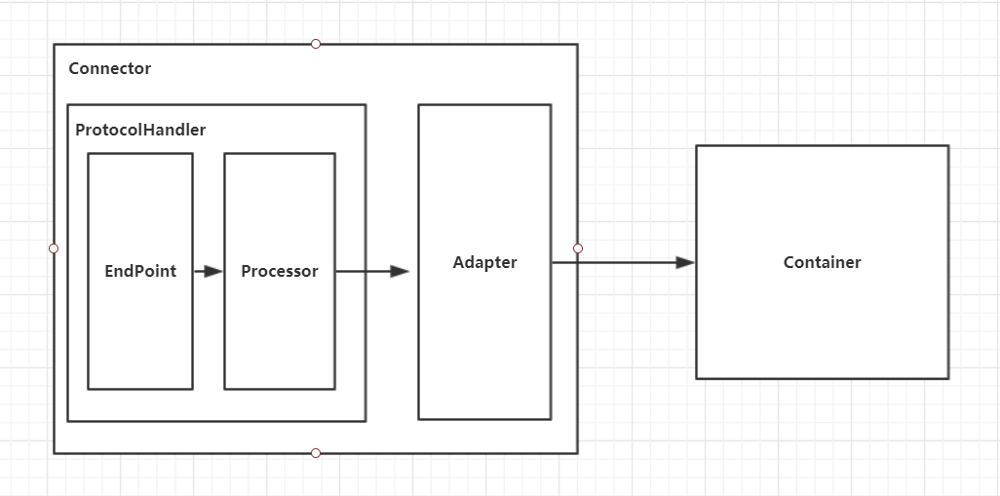
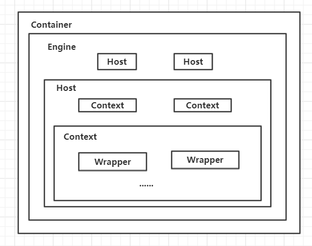

Tomcat中最顶层的容器是Server，代表着整个服务器，一个Server可以包含至少一个Service，用于具体提供服务。Service主要包含两个部分：Connector和Container；Connector用于处理连接相关的事情，并提供Socket与Request和Response相关的转化;Container用于封装和管理Servlet，以及具体处理Request请求。一个Tomcat中只有一个Server，一个Server可以包含多个Service，一个Service只有一个Container，但是可以有多个Connector，这是因为一个服务可以有多个连接。

Connector就是使用ProtocolHandler来处理请求的，不同的ProtocolHandler代表不同的连接类型，比如：Http11Protocol使用的是普通Socket来连接的，Http11NioProtocol使用的是NioSocket来连接的。

其中ProtocolHandler由包含了三个部件：Endpoint、Processor、Adapter。

EndPoint ：EndPoint 是 Coyote 通信端点，即通信监听的接⼝，是具体Socket接收和发送处理器，是对传输层的抽象，因此EndPoint⽤来实现TCP/IP协议的。

Processor：Processor是Coyote 协议处理接⼝ ，如果说EndPoint是⽤来实现TCP/IP协议的，那么Processor⽤来实现HTTP协议，Processor接收来⾃EndPoint的Socket，读取字节流解析成Tomcat Request和Response对象，并通过Adapter将其提交到容器处理，Processor是对应⽤层协议的抽象。

Adapter：由于协议不同，客户端发过来的请求信息也不尽相同，Tomcat定义了⾃⼰的Request类来封装这些请求信息。ProtocolHandler接⼝负责解析请求并⽣成Tomcat Request类。但是这个Request对象不是标准的ServletRequest，不能⽤Tomcat Request作为参数来调⽤容器。Tomcat设计者的解决⽅案是引⼊CoyoteAdapter，这是适配器模式的经典运⽤，连接器调⽤CoyoteAdapter的Sevice⽅法，传⼊的是Tomcat Request对象，CoyoteAdapter负责将Tomcat Request转成ServletRequest，再调⽤容器。

Container用于封装和管理Servlet，以及具体处理Request请求，在Connector内部包含了4个子容器，分别是Engine、Host、Context和Wrapper。这4种组件（容器）是⽗⼦关系。

Engine：表示整个Catalina的Servlet引擎，⽤来管理多个虚拟站点，⼀个Service最多只能有⼀个Engine，但是⼀个引擎可包含多个Host。

Host：代表⼀个虚拟主机，或者说⼀个站点，可以给Tomcat配置多个虚拟主机地址，⽽⼀个虚拟主机下可包含多个Context。

Context：表示⼀个Web应⽤程序， ⼀个Web应⽤可包含多个Wrapper。

Wrapper：表示⼀个Servlet，Wrapper 作为容器中的最底层，不能包含⼦容器。