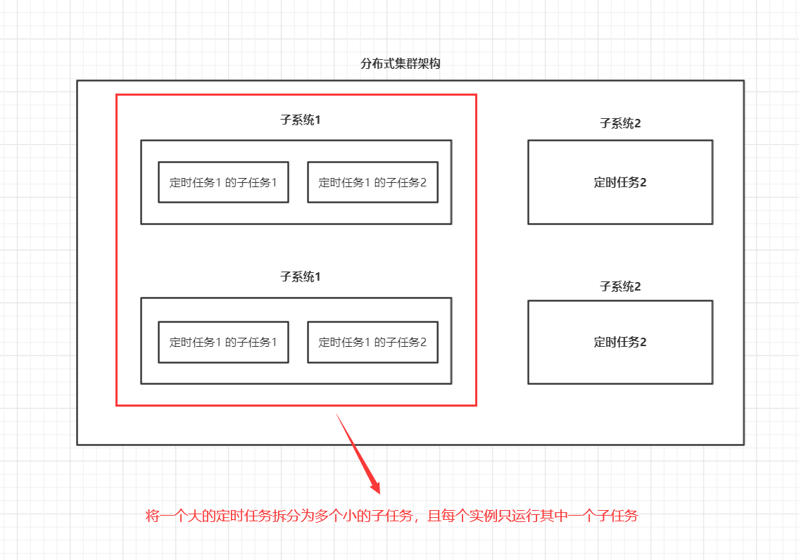
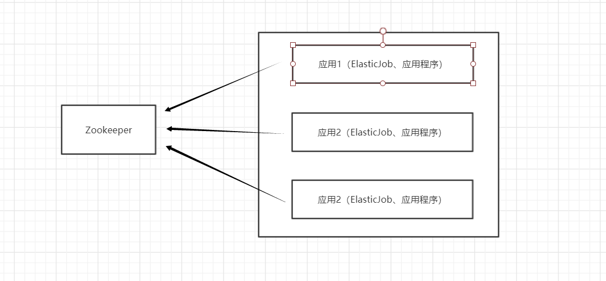
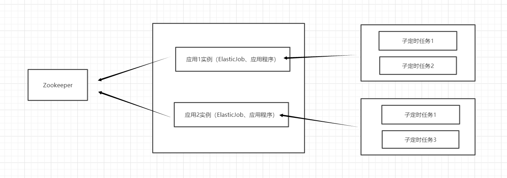

**分布式调度是什么？**

​		（1）把定时任务通过集群的方式进行管理调度，并采用分布式部署，保证系统的高可用，提高了容错；保证同⼀个定时任务程序部署多份，只在集群的某一个节点上执行，即只有⼀个定时任务在执⾏。

​		（2）一个任务拆分为多个独立的任务项，由分布式的机器去分别执行分（即为把⼀个⼤的作业任务拆分为多个⼩的作业任务，同时执⾏）。

**分布式调度的场景？**

​		需要每隔一定时间或者特定某一时刻执行的任务。例如：定时备份数据、数据归档、清理作业、通知、活动、支付系统等

**定时任务与消息队列的差异？**

​		区别：定时任务是时间驱动，消息队列是事件驱动

​		共同点：异步处理、应用解耦、流量削峰

**定时任务的实现方案**

**1、单机实现方案**

​		Timer：是一个定时器类，通过该类可以为指定的定时任务进行配置。TimerTask类是一个定时任务类，该类实现了Runnable接口，缺点异常未检查会中止线程。

​		ScheduledExecutorService：相对延迟或者周期作为定时任务调度，缺点没有绝对的日期或者时间。

​		Spring定时框架：配置简单功能较多，如果系统使用单机的话可以优先考虑Spring定时器。

**2、分布式实现方案**

​		**Elastic-Job**

​		（1） 介绍

​			Elastic-job 是由当当网基于quartz 二次开发之后的分布式调度解决方案 ， 由两个相对独立的子项目Elastic-Job-Lite和Elastic-Job-Cloud组成 。Elastic-job主要的设计理念是无中心化的分布式定时调度框架，思路来源于Quartz的基于数据库的高可用方案。但数据库没有分布式协调功能，所以在高可用方案的基础上增加了弹性扩容和数据分片的思路，以便于更大限度的利用分布式服务器的资源。

​		（2）Elastic-Job-Lite

​			Elastic-Job-Lite使用时需要Elastic-Job-Lite的JAR包，依赖于Zookeeper实现全局作业注册控制中心。

​			**轻量级：**使用方便：只需要JAR包，以及Zookeeper；部署方便：不需要独立部署。

​			**去中心化：**客户端从Zookeeper记录的数据状态中读取信息，拿到信息(数据状态)后，各自执行。

​					1)执行节点对等(程序和jar-样， 唯一 不一样的可能是分片)
​					2)定时调度自触发(没有中心调度节点分配)
​					3)服务自发现(过注册中心的服务发现)
​					4)主节点非固定

​			**任务分片：**

​					ElasticJob可以把作业分为多个的task（每⼀个task就是⼀个任务分⽚），每⼀个task交给具体的⼀个			机器实例去处理（⼀个机器实例是可以处理多个task的），但是具体每个task执⾏什么逻辑由我们⾃⼰来指			定。

